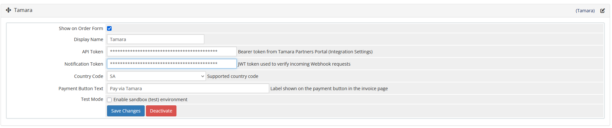
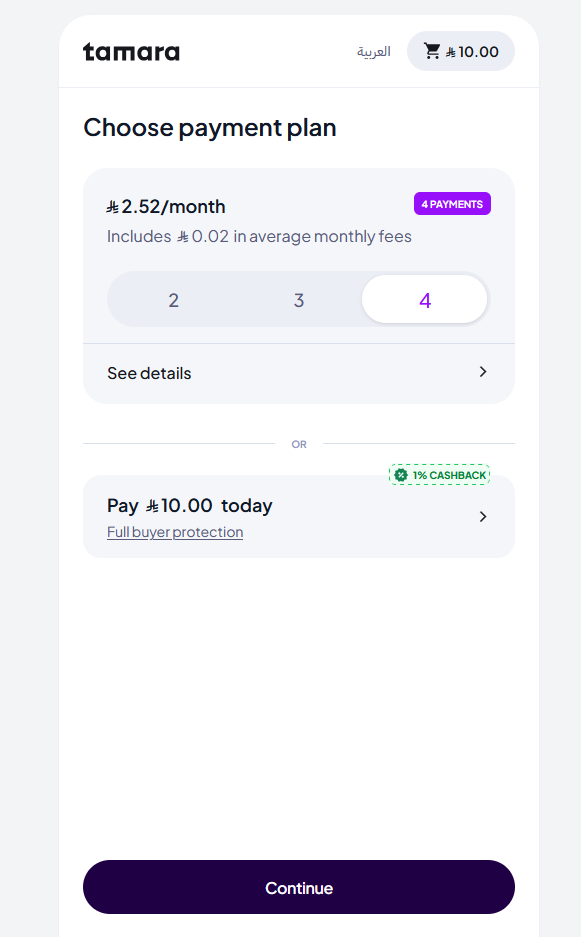
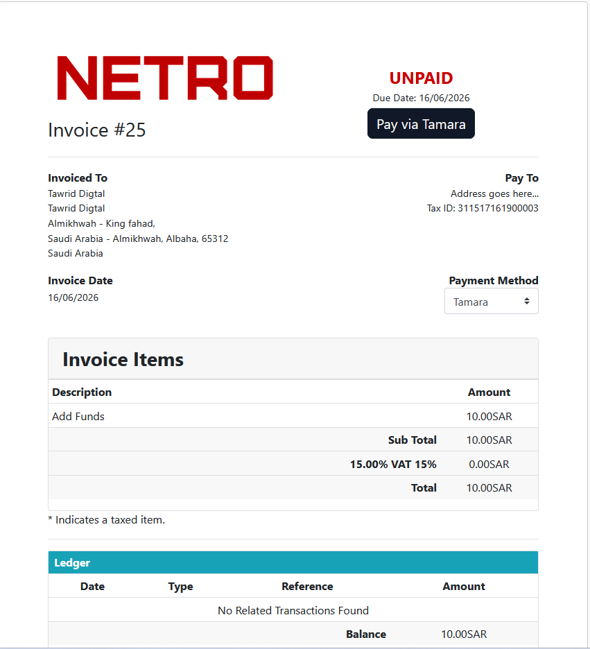

# Tamara Payment Gateway for WHMCS

A modern Buy Now Pay Later (BNPL) payment gateway integration for WHMCS using Tamara, supporting Saudi Arabia and GCC markets.

**Version:** 1.1.0
**Requires:** WHMCS 7.0+
**Author:** Meshari Alomari

---

## Features

* Buy Now Pay Later via Tamara Hosted Checkout
* Supports Saudi Arabia, UAE, Bahrain, Kuwait, and Oman
* Full Authorise and Capture Flow
* Refund Support via Tamara API
* Webhook Notification Verification
* Sandbox and Live Mode Support
* Configurable Payment Button Text
* Automatic Invoice Payment Updates
* Multi-language Support

---

## Compatibility

| Component  | Version |
| ---------- | ------- |
| WHMCS      | 7.0+    |
| PHP        | 7.4+    |
| Tamara API | Latest  |

---

## Requirements

* WHMCS 7.0 or later
* PHP 7.4 or later
* Active Tamara Merchant Account
* Valid Tamara API Credentials

---

## Official Resources

* Website: https://tamara.co
* Partners Portal: https://partners.tamara.co
* API Documentation: https://docs.tamara.co

---

## Installation

1. Upload the module files to your WHMCS installation while maintaining the folder structure:

```text
modules/
└── gateways/
    ├── tamara.php
    └── callback/
        └── tamara.php
```

2. Login to your WHMCS Admin Area.
3. Navigate to Payment Gateways.
4. Activate Tamara.
5. Configure API credentials.
6. Configure webhook endpoint.

---

## Configuration

| Setting             | Description                 |
| ------------------- | --------------------------- |
| API Token           | Tamara API Token            |
| Notification Token  | Webhook Verification Token  |
| Country Code        | SA / AE / BH / KW / OM      |
| Payment Button Text | Custom Payment Button Label |
| Test Mode           | Enable Sandbox Environment  |

---

## Webhook Configuration

```text
https://yourdomain.com/modules/gateways/callback/tamara.php?action=webhook
```

Enable:

* Approved
* Authorised
* Captured

---

## Screenshots

### Gateway Configuration



### Checkout Page



### Invoice Payment



---

## License

MIT License

Copyright (c) 2026 Meshari Alomari

---

## Support

For bug reports, feature requests, or contributions, please create an Issue in this repository.

Email: [devphp03@gmail.com](mailto:devphp03@gmail.com)
